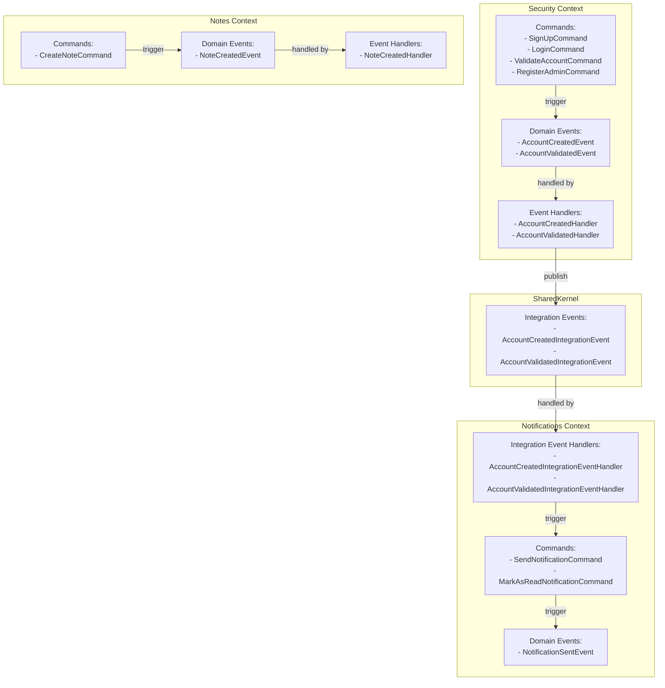

# Event Flow Diagram for Clean DDD Architecture

## Event Flow Details

### Account Creation Flow
1. `SignUpCommandEvent` is handled by `SignUpCommandHandler`
2. `SignUpCommandHandler` creates Account entity and publishes `AccountCreatedEvent`
3. `AccountCreatedEvent` is handled by `AccountCreatedHandler`
4. `AccountCreatedHandler` publishes `AccountCreatedIntegrationEvent` to the event bus
5. `AccountCreatedIntegrationEvent` is received by `AccountCreatedIntegrationEventHandler` in Notifications context
6. `AccountCreatedIntegrationEventHandler` publishes `SendNotificationCommandEvent`
7. `SendNotificationCommandHandler` creates a notification and potentially publishes `NotificationSentEvent`

### Account Validation Flow
1. `ValidateAccountCommandEvent` is handled by `ValidateAccountCommandHandler`
2. `ValidateAccountCommandHandler` validates account and publishes `AccountValidatedEvent`
3. `AccountValidatedEvent` is handled by `AccountValidatedHandler`
4. `AccountValidatedHandler` publishes `AccountValidatedIntegrationEvent` to the event bus
5. `AccountValidatedIntegrationEvent` is received by `AccountValidatedIntegrationEventHandler` in Notifications context
6. `AccountValidatedIntegrationEventHandler` publishes `SendNotificationCommandEvent`
7. `SendNotificationCommandHandler` creates a notification

### Note Creation Flow
1. `CreateNoteCommandEvent` is handled by `CreateNoteCommandHandler`
2. `CreateNoteCommandHandler` creates Note entity and publishes `NoteCreatedEvent`
3. `NoteCreatedEvent` is handled by `NoteCreatedHandler`

## Key Implementation Pattern

Events are passed between contexts using the `ExecutionContext` object, which carries:
- Authentication information
- Logging capabilities
- Event bus reference
- Tracing/transaction information

This allows for maintaining context while crossing boundaries between different domains.