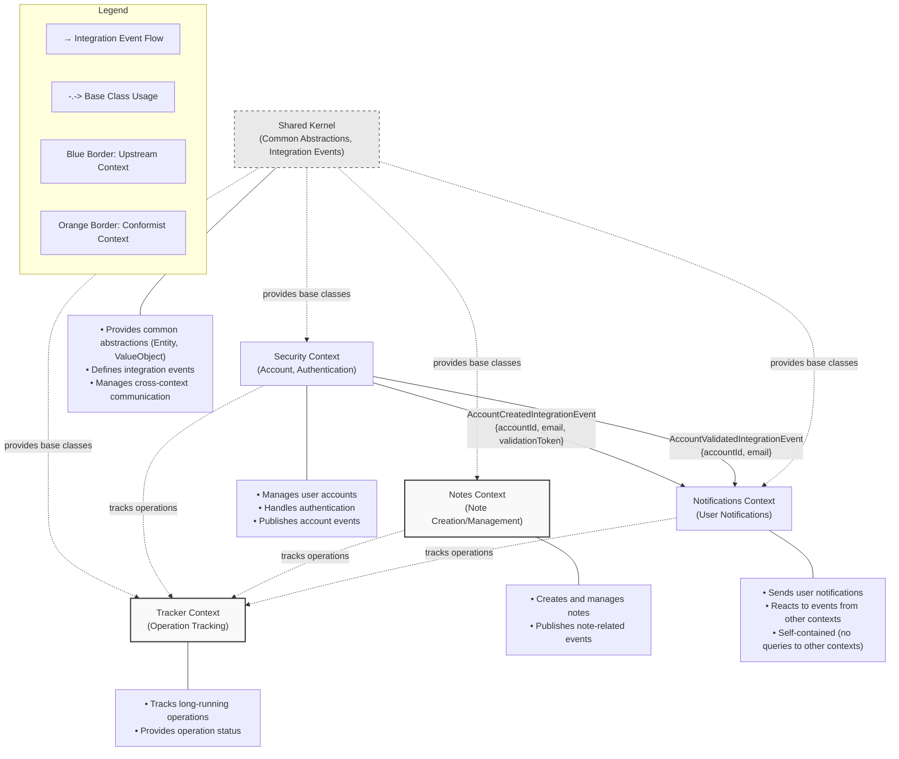

# Bounded Context Relationship Diagram

## Bounded Context Relationships

### Shared Kernel
The Shared Kernel provides common abstractions and cross-cutting concerns to all contexts:
- Base classes (Entity, ValueObject, Repository, etc.)
- Integration event definitions
- Common utilities

### Security → Notifications (Upstream-Downstream)
- Security is the upstream context that publishes events
- Notifications is the downstream context that conforms to the events published by Security
- Complete payload is included in integration events, eliminating the need for cross-context queries:
  - Account Created: `{accountId, email, validationToken}`
  - Account Validated: `{accountId, email}`

### Notes → Notifications
- No direct integration events, but could potentially publish events that Notifications would handle

### All Contexts → Tracker
- All contexts can potentially track long-running operations through the Tracker context
- Operations from any context can be monitored and queried through the Tracker

## Context Responsibilities

### Security Context (Upstream)
- User account management (creation, validation)
- Authentication and authorization
- Role-based access control
- Publishes integration events with complete payload

### Notes Context
- Note creation and management
- Note queries and business rules

### Notifications Context (Conformist)
- Notification creation and delivery
- Reacts to events from other contexts
- Completely self-contained after receiving integration events
- No queries to other contexts
- Manages notification status (read/unread)

### Tracker Context
- Tracks status of long-running operations
- Provides query access to operation history

## Communication Patterns

1. **Integration Events**: Primary method for contexts to communicate
2. **Complete Event Payload**: All necessary data included in the event
3. **Bounded Context Independence**: Each context can function independently after receiving events
4. **Shared Abstractions**: Common types and interfaces defined in Shared Kernel
5. **Event Bus**: Infrastructure component that routes events between contexts