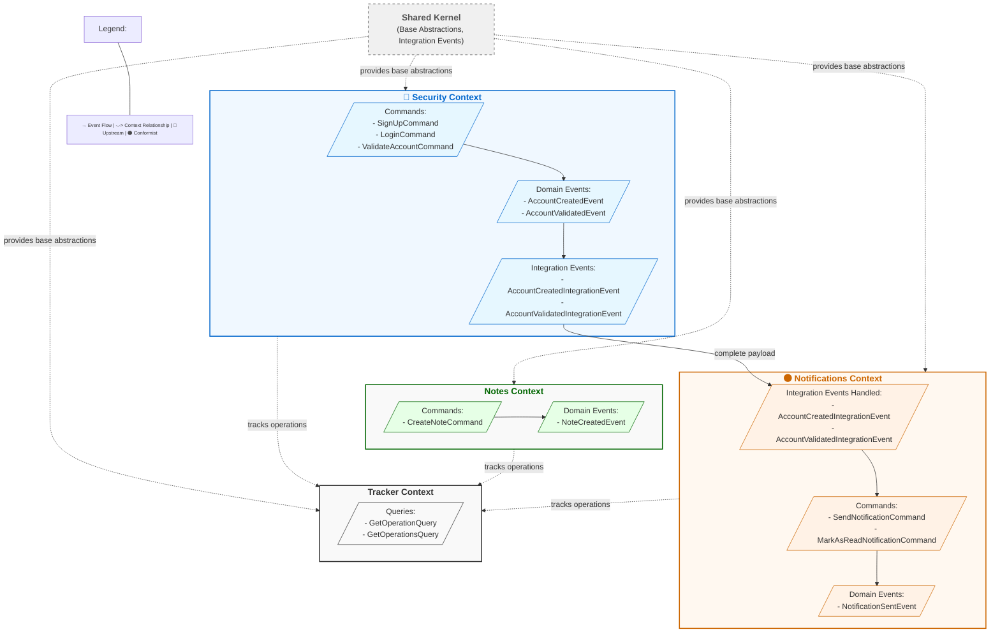

# Clean DDD Framework

A TypeScript implementation of Clean Architecture with Domain-Driven Design following CQRS pattern.

## Core Principles

- **Domain-Driven Design**: Rich domain model focused on business rules
- **Clean Architecture**: Layered architecture with explicit dependency rules
- **CQRS**: Command/query separation for better scalability
- **Event-Driven**: Contexts communicate through domain events

## Project Structure

```
src/
├── Bootstrap/          # Application startup and configuration
├── Contexts/           # Bounded contexts (business domains)
│   ├── @SharedKernel/  # Core abstractions (Entity, ValueObject, Module, etc.)
│   ├── Tracker/        # Operation tracking context
│   ├── Security/       # Authentication and authorization context
│   ├── Notifications/  # Notification management context
│   └── Notes/          # Note management context
```

## Bounded Context Relationships and Event Flow

The following diagram illustrates how the various bounded contexts interact and how events flow through the system:



### Key Event Flows

- **Command → Domain Event → Integration Event**: Events flow from user commands through domain events to integration events
- **Security → Notifications**: Security context publishes integration events with complete payloads that Notifications context consumes
- **Shared Kernel → All Contexts**: Provides base abstractions and shared utilities
- **All Contexts → Tracker**: Operations from any context can be tracked and monitored

## Building Blocks

### Application Class

```typescript
// Example usage of Application primitive
class MyCleanApp extends Application {
  constructor() {
    super();
    this.setEventBus(new InMemoryEventEmitter())
      .registerModule(notesModule)
      .registerModule(trackerModule);
  }

  async start() {
    // Start HTTP server, message consumers, etc.
    const server = new FastifyServer();
    await server.listen(3000);
  }
}

// Start the application
const app = new MyCleanApp();
app.run();
```

### Module System

```typescript
// Defining a module with ModuleBuilder
const notesModule = new ModuleBuilder(Symbol('Notes'))
  .setCommand({
    event: CreateNoteCommand,
    handlers: [new CreateNoteCommandHandler({
      noteRepository,
      eventBus
    })]
  })
  .setQuery(new GetNotesQueryHandler({
    noteQueries
  }))
  .setDomainEvent({
    event: NoteCreatedEvent,
    handlers: [new NoteCreatedHandler()]
  })
  .build();

// Using the module
const createNoteCmd = new CreateNoteCommand({
  title: "My first note",
  content: "This is the content of my note"
});

// Execute command
const result = await notesModule.getCommand(CreateNoteCommand).execute(createNoteCmd);
```

### Domain Model

```typescript
// Entity example
export class Note extends Entity {
  #title: string;
  #content: string;

  private constructor(id: string, title: string, content: string) {
    super(id);
    this.#title = title;
    this.#content = content;
  }

  static create(noteDto: INote): IResult<Note> {
    // Domain validation rules
    if (!noteDto.title) {
      return Result.fail(new InvalidNoteTitleError());
    }
    
    return Result.ok(new Note(
      noteDto._id,
      noteDto.title,
      noteDto.content || ''
    ));
  }

  get title(): string {
    return this.#title;
  }
  
  get content(): string {
    return this.#content;
  }
}

// Value Object example
export class Email extends ValueObject<string> {
  private constructor(email: string) {
    super(email);
  }

  static create(email: string): IResult<Email> {
    if (!email.includes('@')) {
      return Result.fail(new InvalidEmailError(email));
    }
    return Result.ok(new Email(email));
  }

  get username(): string {
    return this.value.split('@')[0];
  }
}
```

### Command Handlers

```typescript
export class CreateNoteCommandHandler extends CommandHandler<CreateNoteCommandEvent> {
  #noteRepository: INoteRepository;

  constructor({ noteRepository }) {
    super();
    this.#noteRepository = noteRepository;
  }

  async execute({ payload }: CreateNoteCommandEvent): Promise<IResult<INote>> {
    // Create the note
    const noteResult = Note.create({
      _id: await this.#noteRepository.nextIdentity(),
      title: payload.title,
      content: payload.content
    });
    
    if (noteResult.isFailure()) return noteResult;

    // Save the note
    const note = noteResult.data;
    await this.#noteRepository.save(note);

    // Return DTO
    return Result.ok(NoteMapper.toDTO(note));
  }
}
```

### Query Handlers

```typescript
export class GetNotesQueryHandler extends QueryHandler<INoteQueries, void, IResult<INote[]>> {
  #noteQueries: INoteQueries;

  constructor({ noteQueries }: { noteQueries: INoteQueries }) {
    super();
    this.#noteQueries = noteQueries;
  }

  async execute(): Promise<ResultValue<INote[]>> {
    try {
      const notes = await this.#noteQueries.getAll();
      return Result.ok(notes);
    } catch (e) {
      return Result.fail(e);
    }
  }
}
```

## Quick Start

```bash
# Install dependencies
yarn install

# Start development server
yarn dev

# Run tests
yarn test

# Build for production
yarn build
```

## Development Commands

```
# Linting and formatting
yarn lint
yarn format


# Testing
yarn test
```

## License

MIT
