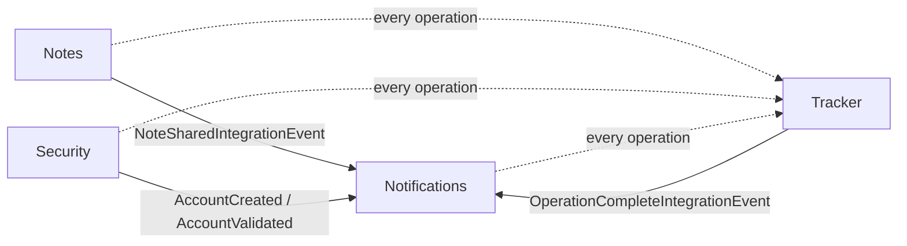

# Clean Architecture & DDD, a reference implementation in TypeScript

A small application (notes you can share, accounts, notifications, operation tracking) written to be **read**: every Domain-Driven Design and Clean Architecture concept appears exactly once, in the simplest form that still does its job, and the architectural rules are checked by tooling rather than by convention.

There is no database and no framework of our own: an in-memory `Map` stands in for persistence, Fastify serves HTTP, and the "framework" is a handful of base classes under `src/Contexts/@SharedKernel` that you can read in one sitting.

- [Start here: one request, end to end](#start-here-one-request-end-to-end)
- [The map: concept → file](#the-map-concept--file)
- [The four contexts and what each one teaches](#the-four-contexts-and-what-each-one-teaches)
- [The rules, and how they are enforced](#the-rules-and-how-they-are-enforced)
- [Layout of a context](#layout-of-a-context)
- [Running it](#running-it)
- [Decisions](#decisions) · [What is deliberately not here](#what-is-deliberately-not-here) · [Known gaps](#known-gaps)

## Start here: one request, end to end

`POST /v1/notes/:id/share` — the owner of a note shares it with another account. Follow the files in this order; each hop is one file with a doc comment that says why it exists.

| # | What happens | Where |
|---|---|---|
| 1 | The controller turns the HTTP request into a command and publishes it on the bus. It answers `202 { operationId }` at once. | [`FastifyNoteController.ts`](src/Contexts/Notes/Presentation/API/REST/Controllers/FastifyNoteController.ts) |
| 2 | The base command handler runs the **guard** (who may do this?), opens a **transaction**, and turns any throw into a failed `Result`. | [`CommandHandler.ts`](src/Contexts/@SharedKernel/Application/CommandHandler.ts) |
| 3 | The use case: load the aggregate, ask it to change, save it, publish what it recorded. Nothing else. | [`ShareNoteCommandHandler.ts`](src/Contexts/Notes/Application/Commands/ShareNote/ShareNoteCommandHandler.ts) |
| 4 | The **aggregate** enforces the rules (only the owner, not archived, not twice, not with yourself) and **records** `NoteSharedEvent`. | [`Note.ts`](src/Contexts/Notes/Domain/Note/Note.ts) |
| 5 | The **repository** persists a snapshot of the aggregate. | [`InMemoryNoteRepository.ts`](src/Contexts/Notes/Infrastructure/Repositories/InMemoryNoteRepository.ts) |
| 6 | Domain events are published **after the transaction commits**, never before. | [`ExecutionContext.ts`](src/Contexts/@SharedKernel/Application/ExecutionContext.ts) (`afterCommit`) |
| 7 | A handler inside Notes translates the domain event into the **published contract**, `NoteSharedIntegrationEvent`. | [`NoteSharedHandler.ts`](src/Contexts/Notes/Application/Events/NoteSharedHandler.ts) → [`NoteIntegrationEvents.ts`](src/Contexts/@SharedKernel/Application/IntegrationEvents/NoteIntegrationEvents.ts) |
| 8 | The Notifications context reacts through an **anti-corruption layer**: it knows the contract and nothing else about Notes. | [`NoteSharedIntegrationEventHandler.ts`](src/Contexts/Notifications/Application/Events/NoteSharedIntegrationEventHandler.ts) |
| 9 | Meanwhile the bus decorator has **projected** the operation into a read model; the client polls `GET /v1/tracker/operations/:id` to learn how it went. | [`TrackedEventBus.ts`](src/Contexts/Tracker/Infrastructure/TrackedEventBus.ts) → [`OperationProjection.ts`](src/Contexts/Tracker/Application/Projections/OperationProjection.ts) |

The same path is exercised end to end by [`note.routes.e2e.spec.ts`](src/Contexts/Notes/Presentation/API/REST/Routes/note.routes.e2e.spec.ts) ("Sharing a note").

## The map: concept → file

One canonical example per concept. When two files could teach the same thing, the table names the one to read; the other exists because the application needs it, not to make a point.

### Domain layer

| Concept | Canonical example | Notes |
|---|---|---|
| Entity | [`Entity.ts`](src/Contexts/@SharedKernel/Domain/DDD/Entity.ts) | identity, `equals()` |
| Aggregate root | [`Note.ts`](src/Contexts/Notes/Domain/Note/Note.ts) on [`AggregateRoot.ts`](src/Contexts/@SharedKernel/Domain/DDD/AggregateRoot.ts) | behaviours enforce invariants and `record()` events; also [`Account.ts`](src/Contexts/Security/Domain/Account/Account.ts), [`Notification.ts`](src/Contexts/Notifications/Domain/Notification/Notification.ts) |
| **Entity inside an aggregate** (not a root) | [`DeliveryAttempt.ts`](src/Contexts/Notifications/Domain/Notification/DeliveryAttempt.ts) | has its own identity, exists only inside `Notification`, reached and persisted through it |
| Value object | [`NoteTitle.ts`](src/Contexts/Notes/Domain/Note/NoteTitle.ts), [`Email.ts`](src/Contexts/@SharedKernel/Domain/Utils/Email.ts), [`Credentials.ts`](src/Contexts/Security/Domain/Account/Credentials.ts) | built through `create()` → `Result`; never invalid once you hold one |
| Identity | [`Id.ts`](src/Contexts/@SharedKernel/Domain/Utils/Id.ts) | generated by the domain (`Id.generate()`), not by the database — [ADR 2](docs/adr/0002-identity-is-generated-by-the-domain.md) |
| Creation vs reconstitution | `Note.create()` vs `Note.fromSnapshot()` in [`Note.ts`](src/Contexts/Notes/Domain/Note/Note.ts) | creation records an event; rebuilding from persistence records nothing — [ADR 4](docs/adr/0004-reconstitution-throws-on-corrupted-data.md) |
| Domain event | [`NoteEvents.ts`](src/Contexts/Notes/Domain/Note/Events/NoteEvents.ts) | past tense, minimal payload, internal to the context |
| Domain exception | [`NoteExceptions.ts`](src/Contexts/Notes/Domain/Note/NoteExceptions.ts) | a broken rule in business words, carried by `Result.fail()`, never thrown — [ADR 1](docs/adr/0001-result-instead-of-exceptions.md) |
| `Result` | [`Result.ts`](src/Contexts/@SharedKernel/Domain/DDD/Result.ts) | `IResult<T>` is the type you write in signatures |
| Repository port | [`INoteRepository.ts`](src/Contexts/Notes/Domain/Note/Ports/INoteRepository.ts) | load / save an aggregate; nothing else |
| Queries port & read models | [`INoteQueries.ts`](src/Contexts/Notes/Domain/Note/Ports/INoteQueries.ts) | returns view shapes, never aggregates — [ADR 5](docs/adr/0005-queries-return-read-models-not-aggregates.md) |
| Snapshot DTO | [`DTOs.ts`](src/Contexts/Notes/Domain/Note/DTOs.ts) | the plain shape that crosses to the infrastructure |
| **Domain service** | [`AccountRegistration.ts`](src/Contexts/Security/Domain/Account/AccountRegistration.ts) | a rule about the whole collection ("one account per email") — needs the port, still pure domain |
| Ports for technical concerns | [`IPasswordHasher.ts`](src/Contexts/Security/Domain/Auth/Ports/IPasswordHasher.ts), [`IJwtService.ts`](src/Contexts/Security/Domain/Auth/Ports/IJwtService.ts) | hashing has a business meaning; the algorithm does not belong here |
| Lifecycle as an enum | [`NoteStatus.ts`](src/Contexts/Notes/Domain/Note/NoteStatus.ts), [`AccountStatus.ts`](src/Contexts/Security/Domain/Account/AccountStatus.ts) | the transitions live in the aggregate, not in the enum |

### Application layer

| Concept | Canonical example | Notes |
|---|---|---|
| Command | [`ShareNoteCommandEvent.ts`](src/Contexts/Notes/Application/Commands/ShareNote/ShareNoteCommandEvent.ts) | a named payload, nothing more |
| Command handler | [`EditNoteCommandHandler.ts`](src/Contexts/Notes/Application/Commands/EditNote/EditNoteCommandHandler.ts) | the shape every "change an existing thing" use case follows |
| Guard (authorization) | `requireSignedIn()` in [`Guards.ts`](src/Contexts/@SharedKernel/Application/Guards.ts), called once at the top of `execute()`; `guard()` in [`RegisterAdminCommandHandler.ts`](src/Contexts/Security/Application/Commands/AddAdmin/RegisterAdminCommandHandler.ts) for role-only rules | *who may call* is answered here; *what they may do to which object* is the aggregate's business |
| Application service | [`NotificationDelivery.ts`](src/Contexts/Notifications/Application/Services/NotificationDelivery.ts) | orchestrates ports for a use case several entry points share; holds no rule of its own |
| Base handler (guard, transaction, safety net) | [`CommandHandler.ts`](src/Contexts/@SharedKernel/Application/CommandHandler.ts) | a concrete handler only writes `execute()` |
| Query handler | [`GetNoteQueryHandler.ts`](src/Contexts/Notes/Application/Queries/GetNote/GetNoteQueryHandler.ts) | reads through the queries port; a refused query is a failed `Result`, not a throw |
| Execution context | [`ExecutionContext.ts`](src/Contexts/@SharedKernel/Application/ExecutionContext.ts) | who is calling, with which logger, bus and unit of work; `withTransaction`, `afterCommit` |
| Publish after commit | `publishDomainEvents()` in [`CommandHandler.ts`](src/Contexts/@SharedKernel/Application/CommandHandler.ts) | [ADR 3](docs/adr/0003-publish-domain-events-after-commit.md) |
| Domain event handler | [`NoteSharedHandler.ts`](src/Contexts/Notes/Application/Events/NoteSharedHandler.ts) | where a fact leaves its context |
| Integration event (published contract) | [`NoteIntegrationEvents.ts`](src/Contexts/@SharedKernel/Application/IntegrationEvents/NoteIntegrationEvents.ts) | the only thing one context may know about another — [ADR 6](docs/adr/0006-integration-events-are-the-only-contract-between-contexts.md) |
| **Anti-corruption layer** | [`NoteSharedIntegrationEventHandler.ts`](src/Contexts/Notifications/Application/Events/NoteSharedIntegrationEventHandler.ts) | restates a foreign fact in local terms |
| **Projection / read model** | [`OperationProjection.ts`](src/Contexts/Tracker/Application/Projections/OperationProjection.ts), [`OperationRecord.ts`](src/Contexts/Tracker/Application/ReadModel/OperationRecord.ts) | a context with no aggregate at all |
| Module (wiring) | [`Module.ts`](src/Contexts/@SharedKernel/Application/Module.ts), used in [`Notes/module.local.ts`](src/Contexts/Notes/module.local.ts) | plain data: which handler answers which command, query, event |

### Infrastructure layer

| Concept | Canonical example | Notes |
|---|---|---|
| Repository implementation | [`InMemoryNoteRepository.ts`](src/Contexts/Notes/Infrastructure/Repositories/InMemoryNoteRepository.ts) | snapshot in, snapshot out |
| Queries implementation | [`InMemoryNoteQueries.ts`](src/Contexts/Notes/Infrastructure/Queries/InMemoryNoteQueries.ts) | builds read models from the same store, here |
| Port implementations | [`JwtService.ts`](src/Contexts/Security/Infrastructure/Services/JwtService.ts) (`jose`), [`BcryptPasswordHasher.ts`](src/Contexts/Security/Infrastructure/Services/BcryptPasswordHasher.ts) | |
| Event bus | [`InMemoryEventBus.ts`](src/Contexts/@SharedKernel/Infrastructure/EventBus/InMemoryEventBus.ts) | the only bus implementation |
| Decorator (cross-cutting concern) | [`TrackedEventBus.ts`](src/Contexts/Tracker/Infrastructure/TrackedEventBus.ts) | tracking layered on any bus; neither the bus nor the handlers know |
| Unit of work | [`InMemoryUnitOfWork.ts`](src/Contexts/@SharedKernel/Infrastructure/UnitOfWork/InMemoryUnitOfWork.ts) | |
| The "database" | [`InMemoryDataSource.ts`](src/Contexts/@SharedKernel/Infrastructure/DataSources/InMemoryDataSource.ts) | a `Map`; the ports are what a real adapter would implement |

### Presentation and bootstrap

| Concept | Canonical example |
|---|---|
| Controller (commands → `202`, queries → sync) | [`FastifyNoteController.ts`](src/Contexts/Notes/Presentation/API/REST/Controllers/FastifyNoteController.ts) |
| Routes and JSON schemas | [`note.routes.ts`](src/Contexts/Notes/Presentation/API/REST/Routes/note.routes.ts), [`note.routes.schema.ts`](src/Contexts/Notes/Presentation/API/REST/Routes/note.routes.schema.ts) |
| Authentication middleware | [`FastifyJWTAuthenticationMiddleware.ts`](src/Contexts/Security/Presentation/API/REST/Middlewares/FastifyJWTAuthenticationMiddleware.ts) — never blocks, makes the caller `GUEST` unless the token verifies |
| Presenters (one use case, several formats) | [`Security/Presentation/Presenters/Auth`](src/Contexts/Security/Presentation/Presenters/Auth) |
| Composition root | [`application.ts`](src/Bootstrap/Fastify/application.ts) on [`Application.ts`](src/Contexts/@SharedKernel/Application/Application.ts) |

### Tests, one style per layer

| Layer | Example | Doubles |
|---|---|---|
| Domain | [`Note.spec.ts`](src/Contexts/Notes/Domain/Note/Note.spec.ts) | none |
| Domain service | [`AccountRegistration.spec.ts`](src/Contexts/Security/Domain/Account/AccountRegistration.spec.ts) | a 10-line fake of the port |
| Application | [`NoteCommandHandlers.spec.ts`](src/Contexts/Notes/Application/Commands/NoteCommandHandlers.spec.ts) | the in-memory repository *is* the double |
| Infrastructure | [`TrackedEventBus.spec.ts`](src/Contexts/Tracker/Infrastructure/TrackedEventBus.spec.ts), [`JwtService.spec.ts`](src/Contexts/Security/Infrastructure/Services/JwtService.spec.ts) | real in-memory pieces |
| End to end | [`note.routes.e2e.spec.ts`](src/Contexts/Notes/Presentation/API/REST/Routes/note.routes.e2e.spec.ts) | a running server |

## The four contexts and what each one teaches


```mermaid
graph LR
    Notes -- NoteSharedIntegrationEvent --> Notifications
    Security -- AccountCreated / AccountValidated --> Notifications
    Tracker -- OperationCompleteIntegrationEvent --> Notifications
    Notes -. every operation .-> Tracker
    Security -. every operation .-> Tracker
    Notifications -. every operation .-> Tracker
```

| Context | Teaches | Read |
|---|---|---|
| **Notes** | the canonical aggregate and everything around it: value object, events, commands, queries, read models, the full path from HTTP to a domain event | [`Note.ts`](src/Contexts/Notes/Domain/Note/Note.ts) first, then any handler |
| **Security** | a **domain service** (email uniqueness), **ports for technical concerns** (hashing, tokens), authentication as a middleware that only identifies and lets guards decide | [`AccountRegistration.ts`](src/Contexts/Security/Domain/Account/AccountRegistration.ts), [`LoginCommandHandler.ts`](src/Contexts/Security/Application/Commands/Login/LoginCommandHandler.ts) |
| **Notifications** | the **downstream** side: anti-corruption layers for three upstream contexts; an aggregate with a **child entity** (`DeliveryAttempt`); one port per delivery channel behind an application service | [`Notification.ts`](src/Contexts/Notifications/Domain/Notification/Notification.ts), [`NotificationDelivery.ts`](src/Contexts/Notifications/Application/Services/NotificationDelivery.ts), [`NoteSharedIntegrationEventHandler.ts`](src/Contexts/Notifications/Application/Events/NoteSharedIntegrationEventHandler.ts) |
| **Tracker** | a **projection**: a read model fed by the event stream, with no aggregate of its own, and the decorator that feeds it | [`OperationProjection.ts`](src/Contexts/Tracker/Application/Projections/OperationProjection.ts), [`TrackedEventBus.ts`](src/Contexts/Tracker/Infrastructure/TrackedEventBus.ts) |

The `@SharedKernel` is not a context: it holds the building blocks ([`Domain`](src/Contexts/@SharedKernel/Domain), [`Application`](src/Contexts/@SharedKernel/Application), [`Presentation`](src/Contexts/@SharedKernel/Presentation), [`Infrastructure`](src/Contexts/@SharedKernel/Infrastructure)) and the integration events, which are the contracts the contexts share.

## The rules, and how they are enforced

| Rule | Enforced by |
|---|---|
| **Dependencies point inward.** Domain depends on nothing. Application depends on Domain. Infrastructure and Presentation depend on both. Nothing depends on Bootstrap. | ESLint `no-restricted-imports`, per layer, in [`.eslintrc.cjs`](.eslintrc.cjs). Application tests may use in-memory infrastructure as doubles. There is no exception left in the codebase. |
| A refused command or query is a **failed `Result`**, never a thrown exception. | Base handlers ([`CommandHandler`](src/Contexts/@SharedKernel/Application/CommandHandler.ts), [`QueryHandler`](src/Contexts/@SharedKernel/Application/QueryHandler.ts)) and [ADR 1](docs/adr/0001-result-instead-of-exceptions.md) |
| Only an **aggregate root** records domain events; a handler never builds one. | Types: `record()` is `protected` on `AggregateRoot` |
| Domain events are published **after the transaction commits**. | `publishDomainEvents()` → `ExecutionContext.afterCommit()`; [`ExecutionContext.spec.ts`](src/Contexts/@SharedKernel/Application/ExecutionContext.spec.ts) |
| A context's Domain never imports another context. Contexts talk through **integration events** only. | ESLint (`@Contexts/*/...` patterns) and [ADR 6](docs/adr/0006-integration-events-are-the-only-contract-between-contexts.md) |
| Queries return read models; repositories return aggregates. Never the other way. | Port types; [ADR 5](docs/adr/0005-queries-return-read-models-not-aggregates.md) |
| One wiring file per context, plain data, no container. | [`module.local.ts`](src/Contexts/Notes/module.local.ts) files |
| It compiles, lints and tests, in CI, on every pull request. | [`ci.yml`](.github/workflows/ci.yml): `yarn lint`, `yarn typecheck`, `yarn test:units` |

## Layout of a context

```
Contexts/Notes/
├── Domain/Note/                 the model: no logging, no HTTP, no persistence
│   ├── Note.ts                  aggregate root
│   ├── NoteTitle.ts             value object
│   ├── NoteStatus.ts            lifecycle
│   ├── Events/NoteEvents.ts     domain events
│   ├── NoteExceptions.ts        broken rules, in business words
│   ├── DTOs.ts                  the snapshot shape
│   └── Ports/                   INoteRepository (write), INoteQueries (read models)
├── Application/
│   ├── Commands/<UseCase>/      command + handler
│   ├── Queries/<UseCase>/       query handler
│   ├── Events/                  reactions to domain events (incl. translation to integration events)
│   └── Services/                application services, when several entry points share a use case
├── Infrastructure/              implementations of the ports
├── Presentation/                controllers, routes + schemas, presenters
└── module.local.ts              wiring: handlers ↔ infrastructure, for the "local" environment
```

## Running it

Requires Node ≥ 20 (`.nvmrc` says 22).

```bash
nvm use
yarn install
yarn start:dev          # http://localhost:10000, Swagger UI at /v1/docs
```

A default administrator is seeded from the settings: `admin@admin.fr` / `admin` (override with `ADMIN_IDENTIFIER` / `ADMIN_PASSWORD`).

```bash
yarn typecheck          # tsc --noEmit
yarn lint               # eslint, including the layer-boundary rules
yarn test:units         # every *.spec.ts except the e2e ones
yarn test:e2e           # against a running server (start it first); the suites share one process and run in order
yarn test               # both
```

## Decisions

Non-obvious choices are recorded as short ADRs in [`docs/adr`](docs/adr):

1. [Result instead of exceptions for expected failures](docs/adr/0001-result-instead-of-exceptions.md)
2. [Identity is generated by the domain](docs/adr/0002-identity-is-generated-by-the-domain.md)
3. [Domain events are published after the transaction commits](docs/adr/0003-publish-domain-events-after-commit.md)
4. [Reconstitution throws on corrupted data](docs/adr/0004-reconstitution-throws-on-corrupted-data.md)
5. [Queries return read models, not aggregates](docs/adr/0005-queries-return-read-models-not-aggregates.md)
6. [Integration events are the only contract between contexts](docs/adr/0006-integration-events-are-the-only-contract-between-contexts.md)

## What is deliberately not here

Each of these is real vocabulary, and each would turn the building blocks back into a framework. The ADRs say when you would add them.

- **A DI container.** `module.local.ts` is the container: `new` and constructor arguments.
- **An ORM or a real database.** The ports are the seam; the in-memory implementations show what an adapter must do.
- **A transactional outbox / message broker.** `afterCommit` is the honest single-process version; [ADR 3](docs/adr/0003-publish-domain-events-after-commit.md) names the gap.
- **A generic Saga / process manager.** The Security → Notifications validation flow is a process; it is expressed as two handlers, not a library.
- **Specification pattern, optimistic concurrency, versioned events.** Add them when a real case asks for them, next to the aggregate that needs them.

## Known gaps

Kept visible rather than hidden:

- `Note.shareWith()` does not check that the recipient account exists; that needs a port towards Security (an account directory) and would make a good small exercise.
- A failed login answers `200` with an error body, for the HTMX front end.
- The e2e suites run against one live server, in file order, and leave data behind.

## License

MIT
