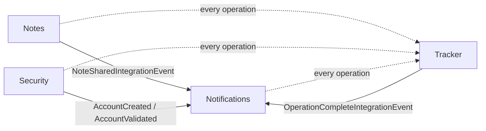

# Clean Architecture & DDD, a reference implementation in TypeScript

A small application (notes you can share, accounts, notifications, operation tracking) written to be **read**: every Domain-Driven Design and Clean Architecture concept appears exactly once, in the simplest form that still does its job, and the architectural rules are checked by tooling rather than by convention.

There is no database and no framework of our own: an in-memory `Map` stands in for persistence, Fastify serves HTTP, and the "framework" is a handful of building blocks under `src/Architecture` that you can read in one sitting. The **shared kernel** (`src/SharedKernel`) is something else, and small: the part of the domain model every context agrees on — an `Email`, the `Role`s, the policy that says who counts as signed in, and the integration events that are the contracts between contexts.

- [Start here: one request, end to end](#start-here-one-request-end-to-end)
- [The map: concept → file](#the-map-concept--file)
- [The four contexts and what each one teaches](#the-four-contexts-and-what-each-one-teaches)
- [The rules, and how they are enforced](#the-rules-and-how-they-are-enforced)
- [Layout of a context](#layout-of-a-context)
- [Running it](#running-it)
- [Vocabulary](#vocabulary) · [Decisions](#decisions) · [What is deliberately not here](#what-is-deliberately-not-here) · [Known gaps](#known-gaps)

## Start here: one request, end to end

`POST /v1/notes/:id/share` — the owner of a note shares it with another account. Follow the files in this order; each hop is one file with a doc comment that says why it exists.

| # | What happens | Where |
|---|---|---|
| 1 | The controller turns the HTTP request into a command and publishes it on the bus. It answers `202 { operationId }` at once. | [`FastifyNoteController.ts`](src/Contexts/Notes/Presentation/API/REST/Controllers/FastifyNoteController.ts) |
| 2 | The base command handler runs the **guard** (who may do this?), opens a **transaction**, and turns any throw into a failed `Result`. | [`CommandHandler.ts`](src/Architecture/Application/CommandHandler.ts) |
| 3 | The use case: load the aggregate, hand it to the domain service, save it, publish what it recorded. Nothing else. | [`ShareNoteCommandHandler.ts`](src/Contexts/Notes/Application/Commands/ShareNote/ShareNoteCommandHandler.ts) |
| 4 | The **domain service** checks the one rule the aggregate cannot check alone (the recipient must exist) through a **port Notes owns**, then lets the aggregate decide. | [`NoteSharing.ts`](src/Contexts/Notes/Domain/Note/NoteSharing.ts) → [`IAccountDirectory.ts`](src/Contexts/Notes/Domain/Note/Ports/IAccountDirectory.ts), answered by [`SecurityAccountDirectory.ts`](src/Contexts/Notes/Infrastructure/Directories/SecurityAccountDirectory.ts) |
| 5 | The **aggregate** enforces the rules (only the owner, not archived, not twice, not with yourself) and **records** `NoteSharedEvent`. | [`Note.ts`](src/Contexts/Notes/Domain/Note/Note.ts) |
| 6 | The **repository** persists a snapshot of the aggregate. | [`InMemoryNoteRepository.ts`](src/Contexts/Notes/Infrastructure/Repositories/InMemoryNoteRepository.ts) |
| 7 | Domain events are published **after the transaction commits**, never before. | [`ExecutionContext.ts`](src/Architecture/Application/ExecutionContext.ts) (`afterCommit`) |
| 8 | A handler inside Notes translates the domain event into the **published contract**, `NoteSharedIntegrationEvent`. | [`NoteSharedHandler.ts`](src/Contexts/Notes/Application/Events/NoteSharedHandler.ts) → [`NoteIntegrationEvents.ts`](src/SharedKernel/Application/IntegrationEvents/NoteIntegrationEvents.ts) |
| 9 | The Notifications context reacts through an **anti-corruption layer**: it knows the contract and nothing else about Notes. | [`NoteSharedIntegrationEventHandler.ts`](src/Contexts/Notifications/Application/Events/NoteSharedIntegrationEventHandler.ts) |
| 10 | Meanwhile the bus decorator has **projected** the operation into a read model; the client polls `GET /v1/tracker/operations/:id` to learn how it went. | [`TrackedEventBus.ts`](src/Contexts/Tracker/Infrastructure/TrackedEventBus.ts) → [`OperationProjection.ts`](src/Contexts/Tracker/Application/Projections/OperationProjection.ts) |

The same path is exercised end to end by [`note.routes.e2e.spec.ts`](src/Contexts/Notes/Presentation/API/REST/Routes/note.routes.e2e.spec.ts) ("Sharing a note").

## The map: concept → file

One canonical example per concept. When two files could teach the same thing, the table names the one to read; the other exists because the application needs it, not to make a point. The tables are rendered from [`conventions/concepts.yaml`](conventions/concepts.yaml), and CI checks that every file they name exists (see [`conventions/`](conventions/README.md)).

### Domain layer

<!-- generated from conventions/concepts.yaml (domain); edit the YAML, then run yarn conventions:write -->
| Concept | Canonical example | Notes |
| --- | --- | --- |
| Entity | [`Entity.ts`](src/Architecture/Domain/Entity.ts) | identity, `equals()` |
| Aggregate root | [`Note.ts`](src/Contexts/Notes/Domain/Note/Note.ts) on [`AggregateRoot.ts`](src/Architecture/Domain/AggregateRoot.ts) | behaviours enforce invariants and `record()` events; also [`Account.ts`](src/Contexts/Security/Domain/Account/Account.ts), [`Notification.ts`](src/Contexts/Notifications/Domain/Notification/Notification.ts) |
| **Entity inside an aggregate** (not a root) | [`DeliveryAttempt.ts`](src/Contexts/Notifications/Domain/Notification/DeliveryAttempt.ts) | has its own identity, exists only inside `Notification`, reached and persisted through it. The criterion: few, consistent with the root in the same change, written through the root. What grows without bound or is written by others is its own aggregate (comments on a note) |
| Value object | [`NoteTitle.ts`](src/Contexts/Notes/Domain/Note/NoteTitle.ts), [`Email.ts`](src/SharedKernel/Domain/Email.ts), [`Credentials.ts`](src/Contexts/Security/Domain/Account/Credentials.ts) | built through `create()` → `Result`; never invalid once you hold one |
| Identity | [`Id.ts`](src/Architecture/Domain/Id.ts) | generated by the domain (`Id.generate()`), not by the database — [ADR 2](docs/adr/0002-identity-is-generated-by-the-domain.md) |
| Factory | `Note.create()` in [`Note.ts`](src/Contexts/Notes/Domain/Note/Note.ts) | the aggregate is its own factory: a static `create()` that validates, generates the identity and records the creation event; the constructor is private. When creation needs a collaborator (a port), the factory is a domain service: [`AccountRegistration.ts`](src/Contexts/Security/Domain/Account/AccountRegistration.ts). No `Factory` class |
| Invariant | `shareWith()` in [`Note.ts`](src/Contexts/Notes/Domain/Note/Note.ts) | a rule that must hold after every change (only the owner, not archived, not twice, not with yourself): checked inside the behaviour, before the state changes and the event is recorded. There is no `validate()` to forget, and no way to reach the state but through the behaviour |
| Creation vs reconstitution | `Note.create()` vs `Note.fromSnapshot()` in [`Note.ts`](src/Contexts/Notes/Domain/Note/Note.ts) | creation records an event; rebuilding from persistence records nothing — [ADR 4](docs/adr/0004-reconstitution-throws-on-corrupted-data.md) |
| Domain event | [`NoteEvents.ts`](src/Contexts/Notes/Domain/Note/Events/NoteEvents.ts) | past tense, minimal payload, internal to the context |
| Domain exception | [`NoteExceptions.ts`](src/Contexts/Notes/Domain/Note/NoteExceptions.ts) | a broken rule in business words, carried by `Result.fail()`, never thrown — [ADR 1](docs/adr/0001-result-instead-of-exceptions.md) |
| `Result` | [`Result.ts`](src/Architecture/Domain/Result.ts) | `IResult<T>` is the type you write in signatures |
| **Optimistic concurrency** | `AggregateRoot.version` in [`AggregateRoot.ts`](src/Architecture/Domain/AggregateRoot.ts); `save()` in [`SqliteNoteRepository.ts`](src/Contexts/Notes/Infrastructure/Repositories/SqliteNoteRepository.ts) (`UPDATE … WHERE version = ?`) and [`InMemoryNoteRepository.ts`](src/Contexts/Notes/Infrastructure/Repositories/InMemoryNoteRepository.ts) | the aggregate carries the version it was read at and never changes it; the repository stores version + 1 and refuses a stale one with `ConcurrencyConflict`, so of two writers who read the same version only the first wins — [ADR 8](docs/adr/0008-optimistic-concurrency-on-the-aggregate.md) |
| Repository port | [`INoteRepository.ts`](src/Contexts/Notes/Domain/Note/Ports/INoteRepository.ts) | load / save an aggregate; nothing else |
| Queries port & read models | [`INoteQueries.ts`](src/Contexts/Notes/Domain/Note/Ports/INoteQueries.ts) | returns view shapes, never aggregates — [ADR 5](docs/adr/0005-queries-return-read-models-not-aggregates.md) |
| Snapshot DTO | [`DTOs.ts`](src/Contexts/Notes/Domain/Note/DTOs.ts) | the plain shape that crosses to the infrastructure |
| **Domain service** | [`AccountRegistration.ts`](src/Contexts/Security/Domain/Account/AccountRegistration.ts) | a rule about the whole collection ("one account per email") — needs the port, still pure domain |
| **Port to another context** (read side) | [`IAccountDirectory.ts`](src/Contexts/Notes/Domain/Note/Ports/IAccountDirectory.ts), used by [`NoteSharing.ts`](src/Contexts/Notes/Domain/Note/NoteSharing.ts), answered by [`SecurityAccountDirectory.ts`](src/Contexts/Notes/Infrastructure/Directories/SecurityAccountDirectory.ts) | Notes asks "does this account exist?" in its own words; only its infrastructure knows Security is next door. The read-side counterpart of the anti-corruption layer for events |
| Ports for technical concerns | [`IPasswordHasher.ts`](src/Contexts/Security/Domain/Auth/Ports/IPasswordHasher.ts), [`ISignedTokens.ts`](src/Contexts/Security/Domain/Auth/Ports/ISignedTokens.ts) | hashing has a business meaning; the algorithm does not belong here |
| Lifecycle as an enum | [`NoteStatus.ts`](src/Contexts/Notes/Domain/Note/NoteStatus.ts), [`AccountStatus.ts`](src/Contexts/Security/Domain/Account/AccountStatus.ts) | the transitions live in the aggregate, not in the enum |
<!-- end generated -->

### Application layer

<!-- generated from conventions/concepts.yaml (application); edit the YAML, then run yarn conventions:write -->
| Concept | Canonical example | Notes |
| --- | --- | --- |
| Command | [`ShareNoteCommandEvent.ts`](src/Contexts/Notes/Application/Commands/ShareNote/ShareNoteCommandEvent.ts) | a named payload, nothing more. It extends `CommandEvent`, one of the three kinds of message in [`EventTypes.ts`](src/Architecture/Domain/EventTypes.ts): a command travels on the same bus as the events and is tracked as an operation, so it has their shape; the class says its intent (one handler, may be refused) |
| Command handler | [`EditNoteCommandHandler.ts`](src/Contexts/Notes/Application/Commands/EditNote/EditNoteCommandHandler.ts) | the shape every "change an existing thing" use case follows |
| Guard (authorization) | `requireSignedIn()` in [`Guards.ts`](src/SharedKernel/Application/Guards.ts), called once at the top of `execute()`; `guard()` in [`RegisterAdminCommandHandler.ts`](src/Contexts/Security/Application/Commands/RegisterAdmin/RegisterAdminCommandHandler.ts) for role-only rules | *who may call* is answered here; *what they may do to which object* is the aggregate's business |
| Application service | [`NotificationDelivery.ts`](src/Contexts/Notifications/Application/Services/NotificationDelivery.ts) | orchestrates ports for a use case several entry points share; holds no rule of its own |
| Base handler (guard, transaction, safety net) | [`CommandHandler.ts`](src/Architecture/Application/CommandHandler.ts) | a concrete handler only writes `execute()` |
| Query handler | [`GetNoteQueryHandler.ts`](src/Contexts/Notes/Application/Queries/GetNote/GetNoteQueryHandler.ts) | reads through the queries port; a refused query is a failed `Result`, not a throw |
| Execution context | [`ExecutionContext.ts`](src/Architecture/Application/ExecutionContext.ts) | who is calling, with which logger, bus and unit of work; `withTransaction`, `afterCommit` |
| Publish after commit | `publishDomainEvents()` in [`CommandHandler.ts`](src/Architecture/Application/CommandHandler.ts) | [ADR 3](docs/adr/0003-publish-domain-events-after-commit.md) |
| Domain event handler | [`NoteSharedHandler.ts`](src/Contexts/Notes/Application/Events/NoteSharedHandler.ts) | where a fact leaves its context |
| Integration event (published contract) | [`NoteIntegrationEvents.ts`](src/SharedKernel/Application/IntegrationEvents/NoteIntegrationEvents.ts) | the only thing one context may know about another — [ADR 6](docs/adr/0006-integration-events-and-owned-ports-are-the-contracts-between-contexts.md) |
| **Anti-corruption layer** | [`NoteSharedIntegrationEventHandler.ts`](src/Contexts/Notifications/Application/Events/NoteSharedIntegrationEventHandler.ts) | restates a foreign fact in local terms |
| **Projection / read model** | [`OperationProjection.ts`](src/Contexts/Tracker/Application/Projections/OperationProjection.ts), [`OperationRecord.ts`](src/Contexts/Tracker/Application/ReadModel/OperationRecord.ts) | a context with no aggregate at all |
| **Non-determinism as a value** (ADR 7) | [`INoteTitleSuggestions.ts`](src/Contexts/Notes/Application/Suggestions/INoteTitleSuggestions.ts) → [`SuggestNoteTitleCommandHandler.ts`](src/Contexts/Notes/Application/Commands/SuggestNoteTitle/SuggestNoteTitleCommandHandler.ts), answered locally by [`FirstLineTitleSuggestions.ts`](src/Contexts/Notes/Infrastructure/Suggestions/FirstLineTitleSuggestions.ts) | a decision the domain cannot make from its own state (a model, a heuristic, a person) enters it as a value the aggregate validates and may refuse; the provenance travels with it and ends on the operation — [ADR 7](docs/adr/0007-non-determinism-enters-the-domain-as-a-value.md) |
| Module (wiring) | [`Module.ts`](src/Architecture/Application/Module.ts), used in [`Notes/module.local.ts`](src/Contexts/Notes/module.local.ts) | plain data: which handler answers which command, query, event |
<!-- end generated -->

### Infrastructure layer

<!-- generated from conventions/concepts.yaml (infrastructure); edit the YAML, then run yarn conventions:write -->
| Concept | Canonical example | Notes |
| --- | --- | --- |
| Repository implementation | [`InMemoryNoteRepository.ts`](src/Contexts/Notes/Infrastructure/Repositories/InMemoryNoteRepository.ts) | snapshot in, snapshot out |
| Queries implementation | [`InMemoryNoteQueries.ts`](src/Contexts/Notes/Infrastructure/Queries/InMemoryNoteQueries.ts) | builds read models from the same store, here |
| **Second adapter of the same port** | [`SqliteNoteRepository.ts`](src/Contexts/Notes/Infrastructure/Repositories/SqliteNoteRepository.ts), [`SqliteNoteQueries.ts`](src/Contexts/Notes/Infrastructure/Queries/SqliteNoteQueries.ts) on Node's built-in `node:sqlite` | the proof that the port is the seam: a real database behind the same interfaces, not one line changed in Domain or Application. The local wiring keeps the in-memory pair; both are held to [`NotePersistence.contract.spec.ts`](src/Contexts/Notes/Infrastructure/NotePersistence.contract.spec.ts) |
| Port implementations | [`JoseSignedTokens.ts`](src/Contexts/Security/Infrastructure/Services/JoseSignedTokens.ts) (`jose`), [`BcryptPasswordHasher.ts`](src/Contexts/Security/Infrastructure/Services/BcryptPasswordHasher.ts) |  |
| Event bus | [`InMemoryEventBus.ts`](src/Architecture/Infrastructure/EventBus/InMemoryEventBus.ts) | the only bus implementation |
| Decorator (cross-cutting concern) | [`TrackedEventBus.ts`](src/Contexts/Tracker/Infrastructure/TrackedEventBus.ts) | tracking layered on any bus; neither the bus nor the handlers know |
| Unit of work | [`InMemoryUnitOfWork.ts`](src/Architecture/Infrastructure/UnitOfWork/InMemoryUnitOfWork.ts) |  |
| The "database" | [`InMemoryDataSource.ts`](src/Architecture/Infrastructure/DataSources/InMemoryDataSource.ts) | a `Map`; the ports are what a real adapter would implement |
<!-- end generated -->

### Presentation and bootstrap

<!-- generated from conventions/concepts.yaml (presentation); edit the YAML, then run yarn conventions:write -->
| Concept | Canonical example |
| --- | --- |
| Controller (commands → `202 { operationId }`, queries → sync; one `refuse()` per controller: `403` not allowed, `404` not found, `400` otherwise, always `{ message }`) | [`FastifyNoteController.ts`](src/Contexts/Notes/Presentation/API/REST/Controllers/FastifyNoteController.ts); every other controller has the same shape |
| Routes and JSON schemas | [`note.routes.ts`](src/Contexts/Notes/Presentation/API/REST/Routes/note.routes.ts), [`note.routes.schema.ts`](src/Contexts/Notes/Presentation/API/REST/Routes/note.routes.schema.ts) |
| Authentication middleware | [`FastifyJWTAuthenticationMiddleware.ts`](src/Contexts/Security/Presentation/API/REST/Middlewares/FastifyJWTAuthenticationMiddleware.ts) — never blocks, makes the caller `GUEST` unless the token verifies |
| Presenters (one use case, several formats) | [`Security/Presentation/Presenters/Auth`](src/Contexts/Security/Presentation/Presenters/Auth), picked per request by [`Format.ts`](src/Architecture/Presentation/Format.ts) — a plain object per controller, no registry |
| Composition root | [`createApplication.ts`](src/Bootstrap/Fastify/createApplication.ts) on [`Application.ts`](src/Architecture/Application/Application.ts): wires, starts the modules, seeds the administrator through the same bus as any command, then listens; [`application.ts`](src/Bootstrap/Fastify/application.ts) is the process entry point |
<!-- end generated -->

### Tests, one style per layer

<!-- generated from conventions/concepts.yaml (tests); edit the YAML, then run yarn conventions:write -->
| Layer | Example | Doubles |
| --- | --- | --- |
| Domain | [`Note.spec.ts`](src/Contexts/Notes/Domain/Note/Note.spec.ts) | none |
| Domain service | [`AccountRegistration.spec.ts`](src/Contexts/Security/Domain/Account/AccountRegistration.spec.ts) | a 10-line fake of the port |
| Application | [`NoteCommandHandlers.spec.ts`](src/Contexts/Notes/Application/Commands/NoteCommandHandlers.spec.ts) | the in-memory repository *is* the double |
| Infrastructure | [`TrackedEventBus.spec.ts`](src/Contexts/Tracker/Infrastructure/TrackedEventBus.spec.ts), [`JoseSignedTokens.spec.ts`](src/Contexts/Security/Infrastructure/Services/JoseSignedTokens.spec.ts) | real in-memory pieces |
| **Contract** (one port, every adapter) | [`NotePersistence.contract.spec.ts`](src/Contexts/Notes/Infrastructure/NotePersistence.contract.spec.ts) | none — `describe.each` over the in-memory and the SQLite adapters, same expectations |
| End to end | [`note.routes.e2e.spec.ts`](src/Contexts/Notes/Presentation/API/REST/Routes/note.routes.e2e.spec.ts) | the whole application, booted in-process by [`application.spec-helper.ts`](src/Bootstrap/Fastify/application.spec-helper.ts), spoken to over HTTP |
<!-- end generated -->

## The four contexts and what each one teaches


```mermaid
graph LR
    Notes -- NoteSharedIntegrationEvent --> Notifications
    Security -- AccountCreated / AccountValidated --> Notifications
    Tracker -- OperationCompleteIntegrationEvent --> Notifications
    Notes -. every operation .-> Tracker
    Security -. every operation .-> Tracker
    Notifications -. every operation .-> Tracker
```

A **bounded context** is one folder under `src/Contexts`, with one vocabulary (the same word means one thing inside it: an *account* in Security is a *recipient* in Notifications), one `module.local.ts`, and integration events as its only public surface. It is the unit you could deploy alone. Four of them here, each teaching what the others do not:

| Context | Teaches | Read |
|---|---|---|
| **Notes** | the canonical aggregate and everything around it: value object, events, commands, queries, read models, the full path from HTTP to a domain event | [`Note.ts`](src/Contexts/Notes/Domain/Note/Note.ts) first, then any handler |
| **Security** | a **domain service** (email uniqueness), **ports for technical concerns** (hashing, tokens), authentication as a middleware that only identifies and lets guards decide | [`AccountRegistration.ts`](src/Contexts/Security/Domain/Account/AccountRegistration.ts), [`LoginCommandHandler.ts`](src/Contexts/Security/Application/Commands/Login/LoginCommandHandler.ts) |
| **Notifications** | the **downstream** side: anti-corruption layers for three upstream contexts; an aggregate with a **child entity** (`DeliveryAttempt`); one port per delivery channel behind an application service | [`Notification.ts`](src/Contexts/Notifications/Domain/Notification/Notification.ts), [`NotificationDelivery.ts`](src/Contexts/Notifications/Application/Services/NotificationDelivery.ts), [`NoteSharedIntegrationEventHandler.ts`](src/Contexts/Notifications/Application/Events/NoteSharedIntegrationEventHandler.ts) |
| **Tracker** | a **projection**: a read model fed by the event stream, with no aggregate of its own, and the decorator that feeds it | [`OperationProjection.ts`](src/Contexts/Tracker/Application/Projections/OperationProjection.ts), [`TrackedEventBus.ts`](src/Contexts/Tracker/Infrastructure/TrackedEventBus.ts) |

Two trees stand beside the contexts, each layered like one. [`src/Architecture`](src/Architecture) holds the **building blocks** ([`Domain`](src/Architecture/Domain), [`Application`](src/Architecture/Application), [`Infrastructure`](src/Architecture/Infrastructure), [`Presentation`](src/Architecture/Presentation)): the mechanics of the architecture, which know no context and no vocabulary — not even the roles. [`src/SharedKernel`](src/SharedKernel) is the **shared kernel** in the DDD sense: the part of the domain model every context agrees on ([`Email`](src/SharedKernel/Domain/Email.ts), [`Role`](src/SharedKernel/Domain/Role.ts), [`requireSignedIn()`](src/SharedKernel/Application/Guards.ts)) and the [integration events](src/SharedKernel/Application/IntegrationEvents) that are the contracts between contexts. The building blocks never import the shared kernel; the shared kernel is built on them; every context may use both. ESLint holds all three statements.

## The rules, and how they are enforced

Every rule has a stable id, a reason, a remediation and says how it is held: by ESLint, by `yarn check:conventions`, by the type checker, by a spec, by review, or by the evaluations. Ask any of them: `yarn architecture rule CONC-OPTIMISTIC` (add `--json` for a tool).

<!-- generated from conventions/architecture.yaml (rules); edit the YAML, then run yarn conventions:write -->
| Rule | Enforced by |
| --- | --- |
| **ARCH-RELATIVE** — A relative import names a sibling file (`./NoteTitle`) and nothing else; anything across directories goes through an alias. | ESLint, generated from `architecture.yaml` · [CLAUDE.md](CLAUDE.md) |
| **ARCH-INWARD** — Dependencies point inward and contexts stay apart — each file imports only what its row of the dependency table allows; there is no exception and none may be added. | ESLint, generated from `architecture.yaml` · [architecture.yaml](conventions/architecture.yaml), [README.md](conventions/README.md) |
| **ARCH-TREES** — The building blocks (@Architecture) import nothing outside themselves, not even the shared kernel; the shared kernel (@SharedKernel) imports the building blocks and no context. | ESLint, generated from `architecture.yaml` · [Architecture](src/Architecture), [SharedKernel](src/SharedKernel) |
| **ARCH-CONTEXT-DECLARED** — Every directory under src/Contexts is a context declared in this file, holds only the declared layers and a module.local.ts. | `yarn check:conventions` · [README.md](conventions/README.md) |
| **ARCH-MODULES-DATA** — A context's wiring is one module.local.ts building `new Module({ name, commands, queries, domainEvents, integrationEvents })`; anything else it exposes is a named export of that file. No container, no builder, no service locator. | review (stated here, not yet mechanical) · [module.local.ts](src/Contexts/Notes/module.local.ts) |
| **ARCH-EXECUTION-CONTEXT** — ExecutionContext carries what exists per request and nothing else — who is calling, the trace, the transaction, the bus, the logger. A mailer, a clock, a model client is a constructor dependency of the handler that needs it. | review (stated here, not yet mechanical) · [ExecutionContext.ts](src/Architecture/Application/ExecutionContext.ts) |
| **DOMAIN-RESULT** — A refused command or query is a failed Result (`IResult<T>` in signatures, `Result.ok()` / `Result.fail(exception)`), never a thrown exception; `throw` is for programming errors and corrupted state only. | a spec · [0001-result-instead-of-exceptions.md](docs/adr/0001-result-instead-of-exceptions.md), [CommandHandler.spec.ts](src/Architecture/Application/CommandHandler.spec.ts) |
| **DOMAIN-RECORDS-EVENTS** — Only an aggregate root records domain events (`this.record(...)` inside a behaviour); handlers never construct one, they call `publishDomainEvents(aggregate, context)` after saving. | the type checker · [AggregateRoot.ts](src/Architecture/Domain/AggregateRoot.ts) |
| **DOMAIN-CREATE-VS-RECONSTITUTE** — `create()` / `register()` validates and records a creation event; `fromSnapshot()` records nothing and throws on corrupted data. | a spec · [0004-reconstitution-throws-on-corrupted-data.md](docs/adr/0004-reconstitution-throws-on-corrupted-data.md), [Note.spec.ts](src/Contexts/Notes/Domain/Note/Note.spec.ts) |
| **DOMAIN-IDENTITY** — An aggregate generates its own identity (`Id.generate()` in `create()`). A repository loads and saves aggregates, and answers the facts a domain rule needs about the collection (`findByEmail`, `countByOwner`); it never hands out identities and never searches for a screen. | review (stated here, not yet mechanical) · [0002-identity-is-generated-by-the-domain.md](docs/adr/0002-identity-is-generated-by-the-domain.md) |
| **DOMAIN-NON-DETERMINISM** — Time is a parameter with a default; identity is generated by the domain; anything else that is not a function of the business state (randomness, a model, a person, another system) lives behind a port named for what it decides, and its result is a plain value the aggregate validates and may refuse. | review (stated here, not yet mechanical) · [0007-non-determinism-enters-the-domain-as-a-value.md](docs/adr/0007-non-determinism-enters-the-domain-as-a-value.md), [SuggestNoteTitleCommandHandler.ts](src/Contexts/Notes/Application/Commands/SuggestNoteTitle/SuggestNoteTitleCommandHandler.ts) |
| **EVENT-AFTER-COMMIT** — Domain events are published after the transaction commits, never before; a rolled-back transaction publishes nothing and leaves the events on the aggregate. | a spec · [0003-publish-domain-events-after-commit.md](docs/adr/0003-publish-domain-events-after-commit.md), [DomainEvents.spec.ts](src/Architecture/Application/DomainEvents.spec.ts) |
| **QUERY-READ-MODELS** — Queries return read models, repositories return aggregates; never the other way. | the type checker · [0005-queries-return-read-models-not-aggregates.md](docs/adr/0005-queries-return-read-models-not-aggregates.md) |
| **CTX-CONTRACTS** — Contexts talk in two ways only — integration events published in the shared kernel, and ports the asking side owns, answered by an adapter over the other context's read model; a context's Domain never imports another context. | ESLint, generated from `architecture.yaml` · [0006-integration-events-and-owned-ports-are-the-contracts-between-contexts.md](docs/adr/0006-integration-events-and-owned-ports-are-the-contracts-between-contexts.md) |
| **CONC-OPTIMISTIC** — An aggregate carries the version it was read at and never changes it; `save()` stores version + 1 and refuses an aggregate that is no longer at the stored version with a ConcurrencyConflictException. | a spec · [0008-optimistic-concurrency-on-the-aggregate.md](docs/adr/0008-optimistic-concurrency-on-the-aggregate.md), [NotePersistence.contract.spec.ts](src/Contexts/Notes/Infrastructure/NotePersistence.contract.spec.ts) |
| **ARCH-MAP-IS-REAL** — Every file the concept map names exists, every documentation link resolves, nothing silences ESLint, and the generated import rules refuse and allow what the probes say. | `yarn check:conventions` · [check-conventions.ts](tools/check-conventions.ts), [concepts.yaml](conventions/concepts.yaml) |
| **ARCH-LEARNABLE** — A newcomer, or an agent, can add a feature in the right shape from the documentation alone. | fresh-agent evaluations · [README.md](docs/evaluations/README.md) |
<!-- end generated -->

### Who may import whom

The dependency table, per layer. `own` is the file's own context, `architecture` the building blocks, `kernel` the shared kernel, `others` any other context; anything not listed is refused, and the refusal names the rule.

<!-- generated from conventions/architecture.yaml (dependencies); edit the YAML, then run yarn conventions:write -->
| A file in… | may import | Rule |
| --- | --- | --- |
| Domain | `own.Domain`, `architecture.Domain`, `kernel.Domain` | ARCH-DOMAIN |
| Application | `own.Domain`, `own.Application`, `architecture.Domain`, `architecture.Application`, `kernel.Domain`, `kernel.Application` | ARCH-APPLICATION |
| Application specs | `own.Infrastructure`, `architecture.Infrastructure` | ARCH-APPLICATION-SPECS |
| Infrastructure | `own.Domain`, `own.Application`, `own.Infrastructure`, `architecture.Domain`, `architecture.Application`, `architecture.Infrastructure`, `kernel.Domain`, `kernel.Application`, `others.Domain`, `libraries` | ARCH-INFRASTRUCTURE |
| Presentation | `own.Domain`, `own.Application`, `own.Presentation`, `architecture.Domain`, `architecture.Application`, `architecture.Presentation`, `kernel.Domain`, `kernel.Application`, `libraries` | ARCH-PRESENTATION |
| wiring_file | `own.*`, `architecture.*`, `kernel.*`, `others.wiring`, `bootstrap`, `libraries` | ARCH-WIRING |
| e2e_specs | `bootstrap`, `libraries` | ARCH-E2E |
<!-- end generated -->

## The architecture contract

The two YAML files under [`conventions/`](conventions/README.md) are the source of truth this page is rendered from, and a machine interface for tools and coding agents:

```bash
yarn architecture inspect                      # contexts, trees, layers, how much of everything
yarn architecture rules | concepts | verbs | checklists        # the lists
yarn architecture rule ARCH-DOMAIN             # statement, why, remediation, references
yarn architecture concept aggregate-root       # canonical files, rules, decisions
yarn architecture verb remove                  # which HTTP verb and path shape a use case takes, and when
yarn architecture checklist aggregate          # what a new one is made of; `place aggregate` for the path alone
yarn architecture can-import src/Contexts/Notes/Domain/Note/Note.ts fastify   # asks ESLint, names the rule
yarn architecture plan validate conventions/plans/share-a-note.yaml           # is this intended change legal?
yarn architecture plan explain  conventions/plans/share-a-note.yaml           # the files, rules and examples it implies
```

A **feature plan** is what someone intends to change, written before writing it, in the contract's own words ([`conventions/plans/share-a-note.yaml`](conventions/plans/share-a-note.yaml) describes a feature that exists, so the check can hold it). `plan validate` answers whether the shape is legal — a declared context, known kinds, a route whose method matches its intent, a cross-context strategy that is one of the two, nothing new where something already exists — and `plan explain` expands it into the files to write, with each checklist's placeholders filled with the plan's own names, the canonical examples to copy, and the rules the work is bound by. It generates no code.

Every command takes `--json`: valid JSON only, a `schemaVersion`, a structured error and a non-zero status for an unknown id. `yarn check:conventions` validates the contract itself (unique ids, references that exist, concepts naming rules that exist) before checking the tree against it.


## Layout of a context

```
Contexts/Notes/
├── Domain/Note/                 the model: no logging, no HTTP, no persistence
│   ├── Note.ts                  aggregate root
│   ├── NoteTitle.ts             value object
│   ├── NoteStatus.ts            lifecycle
│   ├── Events/NoteEvents.ts     domain events
│   ├── NoteExceptions.ts        broken rules, in business words
│   ├── DTOs.ts                  the snapshot shape
│   └── Ports/                   INoteRepository (write), INoteQueries (read models)
├── Application/                 (a context with no Domain, like Tracker, keeps its Ports/ and ReadModel/ here)
│   ├── Commands/<UseCase>/      command + handler
│   ├── Queries/<UseCase>/       query handler
│   ├── Events/                  reactions to domain events (incl. translation to integration events)
│   └── Services/                application services, when several entry points share a use case
├── Infrastructure/              implementations of the ports
├── Presentation/                controllers, routes + schemas, presenters
└── module.local.ts              wiring: handlers ↔ infrastructure, for the "local" environment
```

## Running it

Requires Node ≥ 24 (`.nvmrc` says 24; Jest needs 24.9 or later to load the ESM-only packages Fastify now depends on).

```bash
nvm use
yarn install
yarn start:dev          # http://localhost:10000, Swagger UI at /v1/docs
```

A default administrator is seeded from the settings: `admin@admin.fr` / `admin` (override with `ADMIN_IDENTIFIER` / `ADMIN_PASSWORD`).

```bash
yarn check:conventions  # the tree matches conventions/architecture.yaml, the README map names real files
yarn format:check       # prettier, as CI runs it
yarn typecheck          # tsc --noEmit
yarn lint               # eslint, including the layer-boundary rules
yarn test:units         # every *.spec.ts except the e2e ones
yarn test:e2e           # each suite boots its own application on a free port, with fresh stores; no server to start
yarn test               # both
```

`yarn build` bundles the server with [`deployments/build.js`](deployments/build.js); the Docker and Kubernetes files next to it are described in [`deployments/README.md`](deployments/README.md). They are not part of the reference architecture.

## Vocabulary

The words this README uses, in one line each, with the file that shows them. Where a word has several meanings in the literature, this is the one used here.

<!-- generated from conventions/concepts.yaml (vocabulary); edit the YAML, then run yarn conventions:write -->
| Word | Here it means | See |
| --- | --- | --- |
| Building blocks | the mechanics every context is written with (Entity, AggregateRoot, ValueObject, Result, the handlers, the bus); they know no context and no vocabulary, not even the roles | [`src/Architecture`](src/Architecture) |
| Shared kernel | the part of the domain model every context agrees on — Email, Role, who counts as signed in, and the integration events; not the base classes, which is what the word is often misused for | [`src/SharedKernel`](src/SharedKernel) |
| Bounded context | a folder with its own vocabulary and wiring, talking to others through integration events only | [`src/Contexts`](src/Contexts) |
| Aggregate (root) | the object that owns a consistency boundary: every change goes through one of its behaviours, which checks the invariants and records an event | [`Note.ts`](src/Contexts/Notes/Domain/Note/Note.ts) |
| Entity | an object with an identity that outlives its attributes | [`Entity.ts`](src/Architecture/Domain/Entity.ts), [`DeliveryAttempt.ts`](src/Contexts/Notifications/Domain/Notification/DeliveryAttempt.ts) |
| Value object | an object without identity, compared by value, valid from the moment it exists | [`NoteTitle.ts`](src/Contexts/Notes/Domain/Note/NoteTitle.ts) |
| Invariant | a rule that must hold after every change of an aggregate | `shareWith()` in [`Note.ts`](src/Contexts/Notes/Domain/Note/Note.ts) |
| Domain event | a fact, in the past tense, recorded by an aggregate for the rest of the system | [`NoteEvents.ts`](src/Contexts/Notes/Domain/Note/Events/NoteEvents.ts) |
| Integration event | a fact restated as a published contract for other contexts | [`NoteIntegrationEvents.ts`](src/SharedKernel/Application/IntegrationEvents/NoteIntegrationEvents.ts) |
| Command | a request that something happen; one handler; may be refused | [`ShareNoteCommandEvent.ts`](src/Contexts/Notes/Application/Commands/ShareNote/ShareNoteCommandEvent.ts) |
| Query | a question; answered from a read model; changes nothing | [`GetNoteQueryHandler.ts`](src/Contexts/Notes/Application/Queries/GetNote/GetNoteQueryHandler.ts) |
| Read model | a shape built for reading, not an aggregate | [`INoteQueries.ts`](src/Contexts/Notes/Domain/Note/Ports/INoteQueries.ts) |
| Projection | a read model fed by events | [`OperationProjection.ts`](src/Contexts/Tracker/Application/Projections/OperationProjection.ts) |
| Port | an interface the domain or the application declares in its own words, for something outside | [`INoteRepository.ts`](src/Contexts/Notes/Domain/Note/Ports/INoteRepository.ts), [`IAccountDirectory.ts`](src/Contexts/Notes/Domain/Note/Ports/IAccountDirectory.ts) |
| Adapter | the implementation of a port, in the infrastructure | [`InMemoryNoteRepository.ts`](src/Contexts/Notes/Infrastructure/Repositories/InMemoryNoteRepository.ts), [`SecurityAccountDirectory.ts`](src/Contexts/Notes/Infrastructure/Directories/SecurityAccountDirectory.ts) |
| Repository | the port that loads and saves one aggregate by identity | [`INoteRepository.ts`](src/Contexts/Notes/Domain/Note/Ports/INoteRepository.ts) |
| Domain service | a business rule that spans several aggregates or needs a port | [`AccountRegistration.ts`](src/Contexts/Security/Domain/Account/AccountRegistration.ts), [`NoteSharing.ts`](src/Contexts/Notes/Domain/Note/NoteSharing.ts) |
| Application service | orchestration shared by several entry points; no rule of its own | [`NotificationDelivery.ts`](src/Contexts/Notifications/Application/Services/NotificationDelivery.ts) |
| Anti-corruption layer | the handler that translates a foreign contract into local terms | [`NoteSharedIntegrationEventHandler.ts`](src/Contexts/Notifications/Application/Events/NoteSharedIntegrationEventHandler.ts) |
| Snapshot | the plain shape of an aggregate that crosses to the infrastructure | [`DTOs.ts`](src/Contexts/Notes/Domain/Note/DTOs.ts) |
| Operation | the handle a client gets for a command: its status and outcome. The Tracker records one for every message on the bus, events included, so a trace shows what a command set off | [`Operation.ts`](src/Architecture/Application/Operation.ts) |
| Composition root | the one file that knows every context and builds the application | [`createApplication.ts`](src/Bootstrap/Fastify/createApplication.ts) |
<!-- end generated -->

## Decisions

Non-obvious choices are recorded as short ADRs in [`docs/adr`](docs/adr):

1. [Result instead of exceptions for expected failures](docs/adr/0001-result-instead-of-exceptions.md)
2. [Identity is generated by the domain](docs/adr/0002-identity-is-generated-by-the-domain.md)
3. [Domain events are published after the transaction commits](docs/adr/0003-publish-domain-events-after-commit.md)
4. [Reconstitution throws on corrupted data](docs/adr/0004-reconstitution-throws-on-corrupted-data.md)
5. [Queries return read models, not aggregates](docs/adr/0005-queries-return-read-models-not-aggregates.md)
6. [Integration events, and ports the asking side owns, are the only contracts between contexts](docs/adr/0006-integration-events-and-owned-ports-are-the-contracts-between-contexts.md)
7. [Non-determinism enters the domain as a value](docs/adr/0007-non-determinism-enters-the-domain-as-a-value.md)
8. [Optimistic concurrency on the aggregate](docs/adr/0008-optimistic-concurrency-on-the-aggregate.md)

## What is deliberately not here

Each of these is real vocabulary, and each would turn the building blocks back into a framework. The ADRs say when you would add them.

- **A DI container.** `module.local.ts` is the container: `new` and constructor arguments.
- **An ORM or a database server.** The ports are the seam: the in-memory adapters are wired, the SQLite ones ([`SqliteNoteRepository.ts`](src/Contexts/Notes/Infrastructure/Repositories/SqliteNoteRepository.ts)) prove that a real store fits behind the same interfaces, and one contract test holds both. A third adapter is a new line in that test, not a new pattern.
- **A transactional outbox / message broker, idempotent commands, an inbox.** `afterCommit` is the honest single-process version of publication, and a command arrives once because it arrives over HTTP; [ADR 3](docs/adr/0003-publish-domain-events-after-commit.md) names the gap and what fills it the day messages cross a process boundary.
- **A generic Saga / process manager.** The Security → Notifications validation flow is a process; it is expressed as two handlers, not a library.
- **Specification pattern, versioned events, merge-on-conflict.** Add them when a real case asks for them, next to the aggregate that needs them. (Optimistic concurrency *is* here since [ADR 8](docs/adr/0008-optimistic-concurrency-on-the-aggregate.md); a conflict is refused, never merged.)

## Known gaps

- **In-memory transactions are not isolated from one another.** `InMemoryUnitOfWork` rolls back by restoring a snapshot of each store, which is right for one transaction at a time and wrong for two interleaving on the same store ([ADR 3](docs/adr/0003-publish-domain-events-after-commit.md)). A per-transaction undo log would fix it; a database has one.
- **A refused command that must leave a trace** (a wrong password counted towards a lockout) has no canonical example. [CLAUDE.md](CLAUDE.md) says how it should be shaped; the evaluation branch [`eval/account-lockout`](https://github.com/jgaNet/clean-ddd/tree/eval/account-lockout) is the candidate, found by [an evaluation](docs/evaluations/2026-09-29-account-lockout.md).

When a gap appears, it is listed here with what would fix it, rather than hidden; the previous entries (a shared unit of work, a login answering `200`, e2e suites sharing one server, `shareWith()` not checking the recipient) each became a pull request.


## License

MIT
